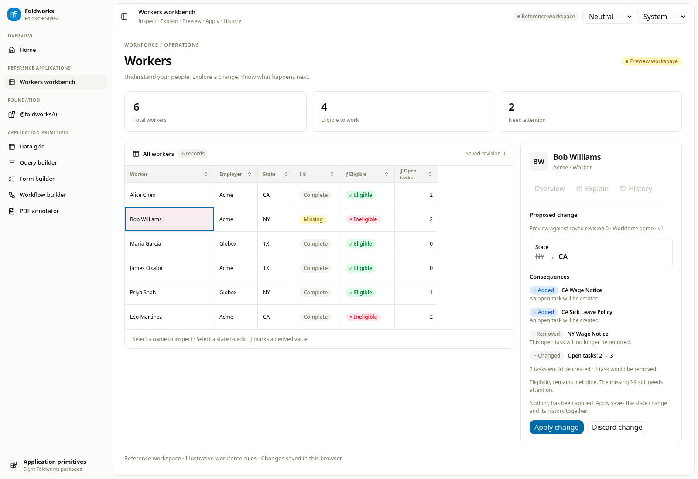

# Workers workbench reference

Open `/workbench` in the Foldworks demo. The reference interaction is:

**Workers → inspect Bob → explain eligibility → propose NY → CA → preview consequences → apply → inspect history.**

The table keeps showing saved values during a proposal. Applying updates Bob's state from NY to CA, adds the two California tasks, removes the New York task, and records an attributed transaction. His open task count changes from 2 to 3. His eligibility stays false because his I-9 is still missing. Saved records and history survive a browser reload.

## Run and verify

```sh
pnpm install --frozen-lockfile
pnpm dev
```

Run the reference scenarios, including screenshots:

```sh
pnpm build:packages
pnpm --filter @foldworks/demo exec vitest run --config vitest.e2e.config.ts -t 'workers workbench'
```

Run the full demo browser suite with `pnpm test:e2e`. The suite builds the production app and uses Playwright with Chrome. Every test gets a separate browser context; the conflict scenario opens two tabs in the same context.

The scenarios assert the full loop, unchanged saved values during preview, discard, reload persistence, an unchanged eligibility result, stale-preview rejection, storage failure, and narrow-screen layout. The main flow enters the worker inspector using the keyboard. Reference images are captured with animations disabled; they are documentation captures, not pixel-difference assertions.

Fresh captures are written to `apps/demo/test-results/demo/workbench-*.png`. The reviewed images below are kept alongside this document. To refresh them after a successful run:

```sh
cp apps/demo/test-results/demo/workbench-*.png docs/workbench/
```

## Reference screens

| Step | Screenshot |
| --- | --- |
| 1. Workers directory | [Workers](workbench-01-workers.png) |
| 2. Object inspector | [Inspect Bob](workbench-02-inspect.png) |
| 3. Eligibility and evidence | [Explanation](workbench-03-explain.png) |
| 4. Draft state change | [Draft](workbench-04-draft.png) |
| 5. Consequence preview | [Preview](workbench-05-preview.png) |
| 6. Applied change and receipt | [History](workbench-06-history.png) |
| 7. History after reload | [Reload](workbench-07-reloaded.png) |
| 8. Dark appearance | [Dark](workbench-08-dark.png) |
| 9. Stale preview rejected | [Conflict](workbench-09-conflict.png) |
| 10. Narrow-screen inspector | [Mobile](workbench-10-mobile.png) |



## Reusable components and adapter boundary

`@foldworks/ui` exports `ValueInspector`, `ExplanationTree`, `ChangeSetPreview`, and `TransactionTimeline`. They accept presentation data and application-owned actions through the existing `view(config, h)` convention. They do not fetch records, evaluate rules, execute transactions, or assume worker-specific fields.

The demo uses the existing `@foldworks/data-grid` for selection, keyboard navigation, sorting, and resizing. Its custom name, state, and eligibility cells open the inspector without replacing the grid. Inspector transitions restore keyboard focus to the record heading.

`apps/demo/src/workbench/domain.ts` is a browser-local reference adapter with illustrative workforce rules. It is not connected to Triplex. Each snapshot contains the workers and audit entries together. Apply takes a Web Lock, checks the proposal's source revision and previous value against storage, writes one snapshot, and only then reports success. Failed writes retain the proposal and saved row; stale previews require discarding and reloading. Unreadable storage disables writes.

Tasks in this adapter are derived from each worker's current facts. The transaction records the added and removed task requirements; there is no external task service. The evidence panel shows the actual three fixture inputs used by the eligibility evaluator, not fabricated source-triple identifiers.

A Triplex host can replace the adapter with pinned reads, derivation explanations, overlays, and attributed commands while keeping the presentation components. Backend permissions, full bitemporal browsing, arbitrary rule authoring, realtime synchronization, range editing, and additional collection views remain future work.
