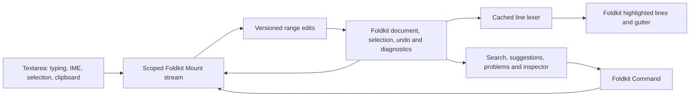

# A code editor from Foldkit primitives

The default `@foldworks/code-editor` entry implements the editor directly in
Foldkit, without another editor engine. Try it at `/code-editor`. It is the single
implementation shipped today; the shared contracts leave room for future
implementations. This remains an exploration of full editor fidelity.

## Use it

```ts
import { CodeEditor } from "@foldworks/code-editor";
import "@foldworks/code-editor/styles.css";

const editor = CodeEditor.init({
  id: "native-example", // Unique among mounted editors.
  uri: "file:///example.ts",
  languageId: "typescript",
  text: "export const answer = 42;\n",
});

CodeEditor.view({
  model: model.editor,
  label: "Source code",
  toParentMessage: (message) => Message.Editor({ message }),
  showInspector: true, // Optional; defaults to true for this exploration.
}, h);
```

Add `CodeEditor.Model` and `CodeEditor.Message` to the parent schemas,
and fold `CodeEditor.update` using `Update.foldChild`, as in the package
README. `OutMessage.ChangedDocument` supplies a document snapshot for persistence
or validation. `RejectedOperation` reports commands that could not be applied.
No registration, custom element, or parent subscription is needed. Importing the
entry does not access browser globals. The core editor imports Foldkit and Effect;
the separate `/structured` entry uses the `yaml` parser for schema validation.

The native API has `Message.Run({ action })`, with actions such as `undo`, `redo`,
`indent`, `outdent`, `comment`, `duplicate`, `deleteLine`, `format`, `findNext`,
`findPrevious`, `replace`, `replaceAll`, `complete`, `goToLine`, and `focus`.
`ReplaceDocument` starts a new session and clears history. `SetLanguage` refreshes
highlighting without discarding history. `SetOptions` changes theme, wrapping,
line numbers, read-only mode, or indentation width. `Reveal({ selection })`
focuses and reveals a UTF-16 range. Commands require the mounted input.

## Who owns what



The browser handles ordinary textarea text input, cursor movement, selection,
clipboard, and composition. Transparent text overlays a highlighted Foldkit view;
the browser caret and selection remain visible. This avoids rebuilding the
operating system's input-method integration just to explore editor semantics.
Textarea selection uses UTF-16 offsets and a separate direction; the model stores
`anchor` and `head` to preserve backward selections.
[MDN textarea reference](https://developer.mozilla.org/en-US/docs/Web/API/HTMLTextAreaElement),
[selection direction](https://developer.mozilla.org/en-US/docs/Web/API/HTMLTextAreaElement/selectionDirection).

The Foldkit model owns the text, document identity/revision, selection, reversible
edit groups, lexical cache, viewport, search state, completion selection, and
versioned diagnostics. Ordinary Foldkit HTML renders syntax spans, logical line
numbers, active line backgrounds, search matches, squiggles, and controls.

The mount stream installs a property setter on the ordinary textarea to receive
model snapshots. It keeps a small queue of unacknowledged revisions, so a slower
render cannot overwrite more recent browser input. Synchronous special-key edits
use pure editing plans and emit the same versioned transactions as normal typing.
Commands check the live mount lease, session, and revision before applying.
Unmounting releases listeners, the resize observer, and scheduled layout work.
Returning to the native view restores model-owned history as well as text.

Input events are the authoritative fallback: not every browser edit produces a
cancelable `beforeinput`. Composition avoids pair insertion and command edits;
intermediate changes share a composition history group. Synthetic tests can check
this plumbing but cannot establish real IME compatibility.
[MDN beforeinput behavior](https://developer.mozilla.org/en-US/docs/Web/API/Element/beforeinput_event).

## What the exploration demonstrates

| Area | Implemented | Boundary |
| --- | --- | --- |
| Document | LF normalization, revision/session identity, validated UTF-16 range edits | Full strings; no rope or piece tree |
| Selection | Browser caret, native selection, backward ranges, selection restoration | One range; model columns count UTF-16 units |
| History | Inverse range edits, grouped typing/deletion/composition, undo/redo branching | 100 groups, up to 100 steps per group; no byte budget |
| Highlighting | JSON/YAML/JS/TS lexer; comments, strings, numbers, keywords; multiline lexical state | Approximate coloring; no template interpolation, JSX structure, regex literals, or semantic tokens |
| Rendering | Highlighted DOM; fixed-height visible lines with overscan when unwrapped | Browser still lays out the full textarea; wrapped mode renders all logical lines |
| Editing | Auto pairs, smart Enter, indent/outdent, comment toggle, duplicate/delete line | Heuristics, not language-aware structural editing |
| Find | Literal, case-sensitive/insensitive, next/previous, replace and undo | First 1,000 matches highlighted; navigation and replacement scan all matches |
| Completion | Keywords and document-word prefixes, keyboard and button selection | No types, member lookup, snippets, ranking, or server provider |
| Diagnostics | JSON syntax checks; optional Effect Schema validation for JSON/YAML; source-scoped batches, squiggles and problem navigation | Synchronous full-document validation; no type checking or LSP transport |
| Accessibility | Labeled textarea, native text selection, keyboard controls, Tab exits, forced-color fallback | Real screen-reader, Safari, mobile and IME checks still needed |

Tab navigates normally. Ctrl/Cmd + ] and [ indent/outdent; Ctrl/Cmd + / toggles
comments; Ctrl/Cmd + F opens search; Ctrl + Space opens suggestions. Arrow keys and
Enter choose a suggestion, Escape closes it. Ctrl/Cmd + Z and Shift + Z undo/redo.
Alt + Shift + Down duplicates; Ctrl/Cmd + Shift + K deletes a line. The toolbar
provides discoverable equivalents for the most common commands.

External diagnostics use `Message.SetDiagnostics({ uri, session, revision,
languageId, source, diagnostics })`, with the same range/severity shape as the
shared contracts. Old results are discarded and new edits clear previous results.
The native entry runs JSON syntax validation synchronously. The `/structured`
entry decorates any implementation with Effect Schema validation for JSON/YAML,
mapping schema paths to source ranges; see the README for `withSchema`. For costly validation,
react to `ChangedDocument` in the parent, debounce/cancel a worker or server request,
and return a batch tagged with the original document identity. The editor
does not bundle an asynchronous validator runner.

## What full fidelity would require

Foldkit can own the state machine and compose the surrounding UI. The difficult
part is making its document engine and view precise, incremental, and responsive
under every editing operation. A production implementation would need these layers:

1. **Document transactions.** Replace full-string scans with a persistent piece
tree or rope and indexed line metadata. Define atomic multi-edit transactions,
selection mapping, history isolation, grapheme-safe operations, byte budgets, and
stable document identities. Property-based tests should prove inverses and range
mapping across randomly generated edits. Decide how large buffers and derived
caches interact with Foldkit devtools and serialization.

2. **Layout and input.** Introduce measured visual lines, wrapped-line indexing,
scroll anchoring, horizontal reveal, hit testing, and grapheme/bidi-aware cursor
geometry. Keep an accessible input bridge while separating its buffer from the
whole document. Add multiple selections, rectangular selection, drag/drop, column
memory, and composition anchoring. Test zoom, fractional pixels, variable fonts,
emoji sequences, RTL mixtures, screen readers, and operating-system input methods.
`Intl.Segmenter` can help establish grapheme boundaries; it does not supply bidi
layout, shaping, or a complete editor cursor model.
[MDN Intl.Segmenter](https://developer.mozilla.org/en-US/docs/Web/JavaScript/Reference/Global_Objects/Intl/Segmenter).

3. **Incremental syntax.** Move parsing to workers with versioned incremental
updates, convergence/cancellation, language-specific indentation, bracket matching,
folding, and semantic token overlays. Render only dirty visible lines and map
syntax/decoration ranges through transactions. Reusing a parser library would
still leave the editor engine and view native to Foldkit.

4. **Language services.** Define engine-independent providers for completion,
hover, definitions, references, formatting, code actions, and rename. Add an
optional LSP client with transport ownership, document synchronization, negotiated
position encoding, cancellation, and server restart handling. Gate every returned
edit by document version and apply it as an undoable transaction. Diagnostics are
already an initial connection point; they are only one part of language tooling.

5. **Editor workflows.** Build completion/snippet sessions, hover and signature
help, problems navigation, minimap/folding, multiple documents, diffs, and workspace
search using the document and provider interfaces. Keep file persistence and
project policy outside the editor. Collaboration would need a separate operation
and history design rather than replaying UI messages over the network.

Proceed by proving input/transaction invariants before expanding the feature
surface. Benchmark real workloads: rapid typing during validation, edits at the top
of a large file, one extremely long line, wrapped scrolling, and rapid file switches.
The 2,000-line demo demonstrates bounded highlighted DOM, not a large-file
performance guarantee. Tokenization still splits/scans the full string on each
edit, search scans the document, and textarea layout remains proportional to content.

The implementation makes editor state and behavior inspectable as ordinary Foldkit
code. Host operations, diagnostic batches, and outgoing events are defined in
`src/contracts.ts`; the native implementation satisfies `EditorImplementation`.
A future implementation can keep its own internal model and view while accepting
those same host contracts. See the README for the public integration boundary.
